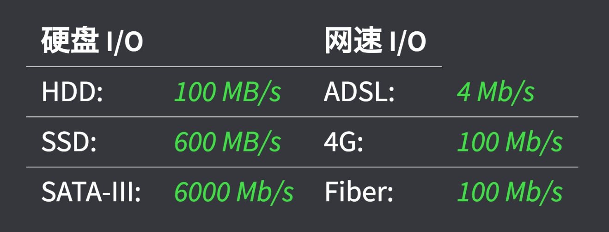

# 前端模块化

### 1、石器时代
- 以前我们是这么写代码的：
```
function foo(){
    //...
}
function bar(){
    //...
}
```
都知道这样会造成变量的全局污染，变量名冲突

- 后来我们做了改进：
```
var Module = (function($){
    var _$body = $("body");     // we can use jQuery now!
    var foo = function(){
        console.log(_$body);    // 特权方法
    }
    // Revelation Pattern
    return {
        foo: foo
    }
})(jQuery)

Module.foo();
```
利用匿名闭包的模式包裹变量，并暴露一些公共方法，还可以引入依赖 `jQuery`,
也就是 `模块模式` ， 也就是现代模块实现的基石

- 虽然做了模块化封装，但还不够

现实项目中我们往往需要加载多个脚本
```
   script(src="zepto.js")
   script(src="jhash.js")
   script(src="fastClick.js")
   script(src="iScroll.js")
   script(src="underscore.js")
   script(src="handlebar.js")
   script(src="datacenter.js")
   script(src="deferred.js")
   script(src="util/wxbridge.js")
   script(src="util/login.js")
   script(src="util/base.js")
   script(src="util/city.js")
   script(src="util/date.js")
   script(src="util/cookie.js")
   script(src="app.js")
```
项目脚本的加载，弊端是
难以维护，需要顺序执行，依赖模糊，请求过多

### 2、模块时代的到来 ： CommonJS 规范
跳出浏览器，CommonJS 是以在浏览器环境之外构建 JavaScript 生态系统为目标而产生的项目，
比如在服务器 node 环境中

模块的定义和使用

```
// math.js
exports.add = function(a, b) {
  return a + b;
};
-----------------------------------
// main.js
var math = require('./math.js');
math.add(111,222); // 333
------------------------------------
// node  main.js  执行
```
或许你可能在别的地方看到 `module.exports` 的方式来导出模块，`module.exports` 是什么玩意儿？
`exports` 只是 `module.exports` 的辅助方法，`exports` 所做的事情是收集属性，可以把 `exports` 看成一个
空对象 `exports.add = function(a, b) {}` 就是对象上定义 add() 方法，最终把收集的属性赋值
给 `module.exports` ，如果文件中存在 `module.exports` 赋值，那么将会忽略掉 `exports`收集的属性

例子：
```
// math2.js
var math2 = function() {
  this.add = function(a, b) {
    return a + b;
  };
  this.minus = function(a, b) {
    return a - b;
  };
};
// add方法 会被忽略
exports.add = function(a, b) {
  return a + b;
};
module.exports = new math2();
-----------------------------------
// main.js
var math2 = require('./math2.js');
math2.add(444,111); // 555
```

### 3、浏览器端的模块 ：AMD、CMD
CommonJS 规范不适合浏览器开发， CommonJS 规范的模块加载时同步的，阻塞的，而浏览器通过网络加载模块，网速不行的话就将阻止模块的加载以及后面功能的运行。但服务端使用CommonJS 规范为什么就行呢？

因为服务端加载脚本是从磁盘硬件上读取的,下图可以看出：
同步加载对 服务器/本地环境 不是问题，浏览器环境才是问题



（1）、浏览器模块化方案： AMD
`RequireJS` 是一个工具库，是 `AMD规范`(Asynchronous Module Definition)的实现者。或许会把 `RequireJS` 和 `AMD规范`混为一谈，AMD只是一种规范，定义异步模块的加载规则，而 `RequireJS` 是脚本代码，这套异步加载规则的实现代码。
下面一个例子利用 RequireJS 来实现 AMD规范

> index.html

引入 require.js 设置 data-main 属性（用来指定网页程序的主模块），该属性会去加载对应目录下的 main.js
```
<script src="./lib/require.js" data-main="./main"></script>
```
> main.js

`require.config` 配置需要加载的模块名和对应的加载路径
```
require.config({
    paths: {
        "jquery": "./lib/jquery.min",
        "math": './src/math',
        "add50": './src/add50'
    }
});

require(['jquery','math'], function ($,math){
    console.log('start main.js ...✈️')
    console.log(math.add(1,1))
    $('#j_ptext').css('color','red')
});
```

> math.js

`define` 定义一个待加载的模块
```
define(function (){
    console.log('start math.js ...🚘')
    var add = function (x,y){
        return x+y;
    };
    return {
        add: add
    };
});
```
如果定义的模块有依赖其他模块，添加第一个形参为模块名，如下面依赖了math模块
```
define(['math'],function (math){
    var add50 = function (x){
        return math.add(x, 50)
    };
    return {
        add50: add50
    };
});
```
可以打开 Chrome 控制台，查看 Network 目录，看的出这些模块是通过 GET 网络请求按需加载的。而且 Type 类型是 script ，相当于加载一段脚本代码，脚本代码加载完会立即执行，这一点可以等下和 CMD规范 做过比较


（2）、浏览器模块化方案： CMD
CMD规范（Common Module Definition）同样也有对应的实现代码，那就是SeaJS ，SeaJS的作者是淘宝前端大牛玉伯，SeaJS 定义模块的风格跟 CommonJs 比较像
例子：

> index.html

引入 sea.js ，定义 config 并配置入口文件 seajs.use
```
<script src="./lib/sea.js"></script>
<script type="text/javascript">
    // seajs 的简单配置
    seajs.config({
        base: "./",
        alias: {
            "jquery": "lib/jquery.min.js"
        }
    })
    // 加载入口模块
    seajs.use("./main")
</script>
```

> main.js

```
// 所有模块都通过 define 来定义
define(function(require, exports, module) {
    console.log('start main.js ...✈️')
    // 通过 require 引入依赖
    require('jquery');
    $('#j_ptext').css('color','red')

    var math = require('./src/math');
    console.log(math(2,9))
});
```

> math.js

```
define(function(require, exports, module) {
    console.log('start math.js ...🚘')
    var add = function (x,y){
        return x+y;
    };
    // 或者通过 module.exports 提供整个接口
    module.exports = add
});
```

##### 浏览器模块化方案 小结：
为什么会出现 AMD规范 和 CMD规范 呢，出现就有他们的道里，下面对 AMD规范 和 CMD规范 做个比较，
或者说是两种规范的实现方式进行比较
SeaJs 和 RequireJS 的异同：下面是 玉伯 在知乎的回答，查阅详情的点击👇链接

>作者：玉伯
链接：https://www.zhihu.com/question/20342350/answer/14828786
来源：知乎
著作权归作者所有。商业转载请联系作者获得授权，非商业转载请注明出处。

再补充一点异同是 `SeaJS对模块的态度是懒执行, 而RequireJS对模块的态度是预执行` 链接专业术语较多，补充的这一点是两种模块最主要的区别之一
RequireJS 是这么去加载依赖的，及所谓的依赖前置，导致的结果就是例子中的依赖 `jquery` 和 `math` 会先加载并执行，接着猜执行
`console.log('start main.js ...✈️')`
```
require(['jquery','math'], function ($,math){
    console.log('start main.js ...✈️')
});
```
而 SeaJS 是依赖后置,它会先执行 `console.log('start main.js ...✈️')` 在去加载依赖，接着再执行依赖
```
define(function(require, exports, module) {
    console.log('start main.js ...✈️')
    // 通过 require 引入依赖
    require('jquery');
});
```

### 4、UMD : 统一写法

既然CommonJs和AMD风格一样流行，似乎缺少一个统一的规范。所以人们产生了这样的需求，希望有支持两种风格的“通用”模式，
于是通用模块规范（UMD）诞生了。
下面这种写法它兼容了AMD和CommonJS，同时还支持老式的“全局”变量规范：

```
JavaScript

(function (root, factory) {
    if (typeof define === 'function' && define.amd) {
        // AMD
        define(['jquery', 'underscore'], factory);
    } else if (typeof exports === 'object') {
        // Node, CommonJS之类的
        module.exports = factory(require('jquery'), require('underscore'));
    } else {
        // 浏览器全局变量(root 即 window)
        root.returnExports = factory(root.jQuery, root._);
    }
}(this, function ($, _) {
    //    方法
    function a(){};    //    私有方法，因为它没被返回 (见下面)
    function b(){};    //    公共方法，因为被返回了
    function c(){};    //    公共方法，因为被返回了

    //    暴露公共方法
    return {
        b: b,
        c: c
    }
}));
```

### 5、王者归来 ：ES6 module

ES6 统一了模块规范

```
// math.js
export default math = {
    PI: 3.14,
    foo: function(){}
}
// app.js
import math from "./math";
math.PI
```
but ，，模块太先进了，浏览器不支持 😢 ， 好在有了 bable ，配合 webpack 完美解决前端模块化

### 送你上天 ：webpack 模块打包器(module bundler)

#### (1)、基础
webpack 的基础配置就不写了，可以稍微看一下经过下面 loader 处理后文件的输出情况
```
test: /\.js$/,
use: {
    loader: "babel-loader",
     options: {
          presets: [
              "es2015"
          ]
     }
},
```

其中需要 loader 的 app.js 只有一个log

```
// app.js
console.log('.....app.js.......');
```

输出（内容较多，伪代码如下）：

```
(function (modules) {
    function __webpack_require__(moduleId) {
    	modules[moduleId].call(module.exports, module, module.exports, __webpack_require__);
    }
    return __webpack_require__(__webpack_require__.s = 0);
})([
    function(module, exports, __webpack_require__) {
        "use strict";
        console.log('.....app.js.......');
    }
])
```
将模块打包成一个 function ，再利用 js 立即执行函数 去执行 function模块

#### （2）、打包各种规范模块

用 webpack 分别打包 AMD 、CMD 、commonjs 和 es6 方式 export 出的模块

下面只是代码片段，例子请看项目 `/前端模块化/Webpack/demo1`
```
import amd from './src/module_amd'
import cmd from './src/module_cmd'
import commonjs from './src/module_commonjs'
import es6 from './src/module_es6'

console.log(amd)        // object
console.log(cmd)        // object
console.log(commonjs)   // object
console.log(es6)        // object

amd.add(11,22)        //33
cmd.add(11,22)        //33
commonjs.add(11,22)   //33
es6.add(11,22)        //33
```
看出无论用哪种方式定义模块，都能利用 import 进行模块的引入，这得力于 bable-loader，让
我们在写代码时统一了规范

#### （3）、对模块进行提取 CommonsChunkPlugin
- 情况1
```
entry: {
     app: './app.js'
},

new webpack.optimize.CommonsChunkPlugin({
     name: 'vendor',       // 上面 entry 入口定义的节点组
     filename:'vendor.js'  //最后生成的文件名，随意
}),
```
当 webpack 的 entry 入口只有一个文件的时候，利用 CommonsChunkPlugin 提取出的只是
webpack的运行文件

- 情况2
```
entry: {
     app: './app.js',
     vendor: ['./src/a.js'] // 指定公共模块
},

new webpack.optimize.CommonsChunkPlugin({
     name: 'vendor',       // 上面 entry 入口定义的节点组
     filename:'vendor.js'  //最后生成的文件名，随意
}),
```
当 webpack 的 entry 入口有多个时，CommonsChunkPlugin 的 name 参数指向 entry 对应的 key，
key 指向的文件会被全局提出出来，并和`webpack的运行文件`打成一个 vendor 包

更多情况可点击下面链接 (链接)['https://segmentfault.com/q/1010000009070061/a-1020000009073036']


